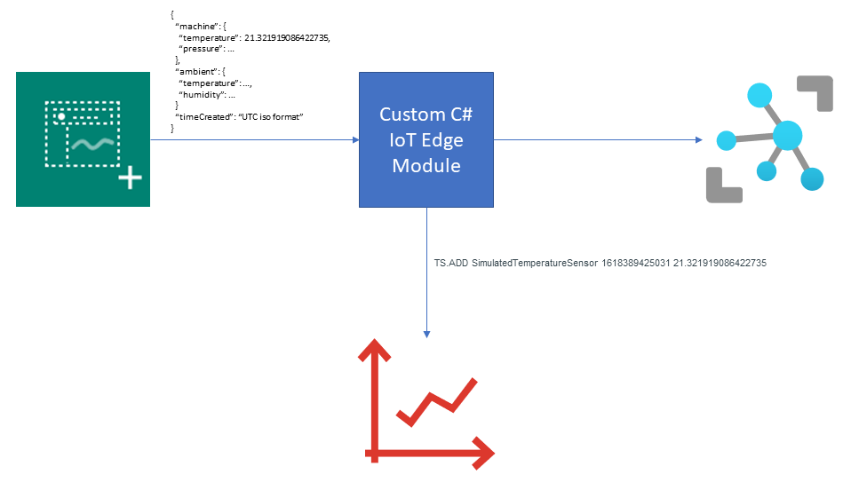
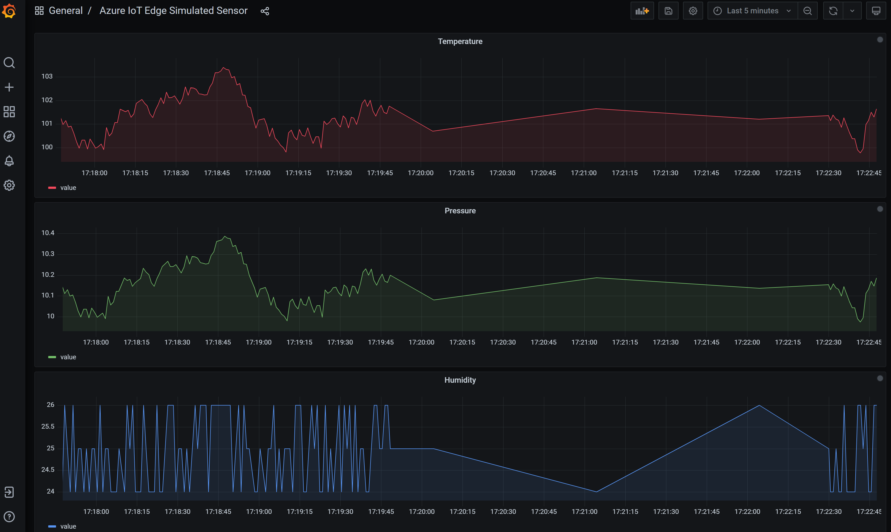
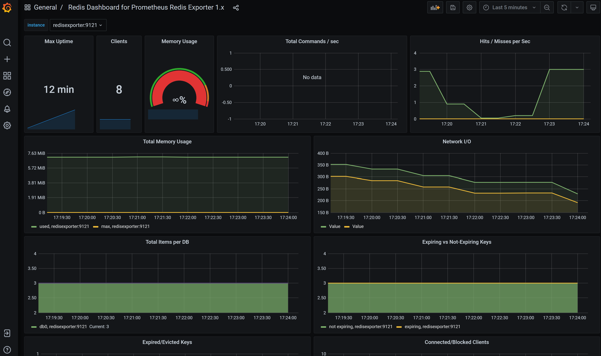

# azure-iot-edge-redis-timeseries
This sample Azure IoT Edge solution demonstrates how to store sensor timeseries data in RedisTimeSeries. The [Simulated Temperature Sensor](https://azuremarketplace.microsoft.com/en-us/marketplace/apps/azure-iot.simulated-temperature-sensor?tab=overview) edge module is used to generate temperature, pressure and humidity readings. These readings are then routed to our custom C# edge module which stores them in [RedisTimeSeries](https://oss.redislabs.com/redistimeseries/).

The custom edge module also provides an [Azure IoT Hub Direct Method](https://docs.microsoft.com/en-us/azure/iot-hub/iot-hub-devguide-direct-methods) named `GetTimeSeriesInfo`. This method can be used to retrieve statistics about the stored data in RedisTimeSeries.

## Grafana Dashboards
Simulated TimeSeries dashboard was created using the [Redis Data Source for Grafana
](https://github.com/RedisGrafana/grafana-redis-datasource).

Redis usage dashboard was created using the [Prometheus Redis Metrics Exporter.
](https://github.com/oliver006/redis_exporter)

