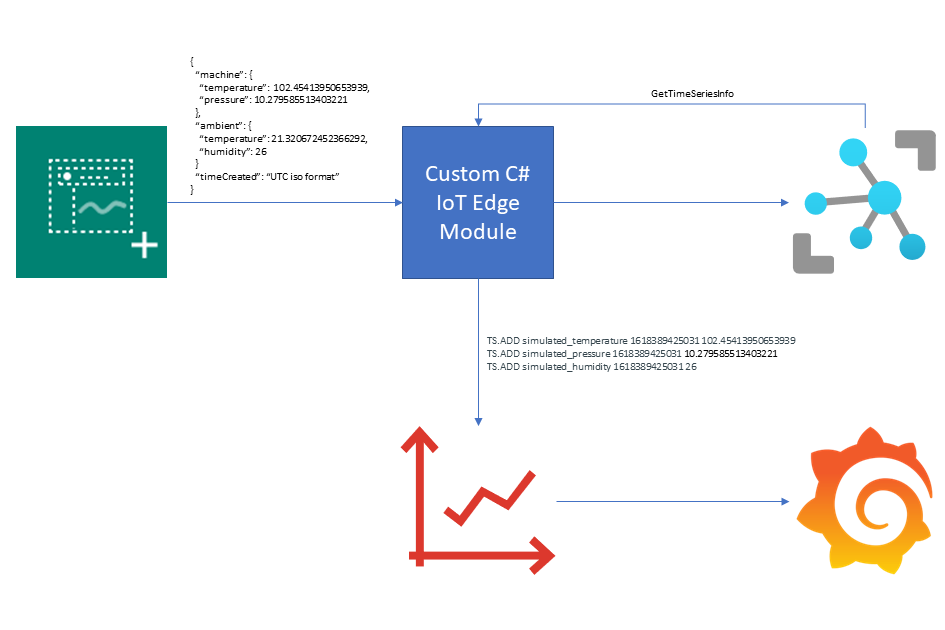
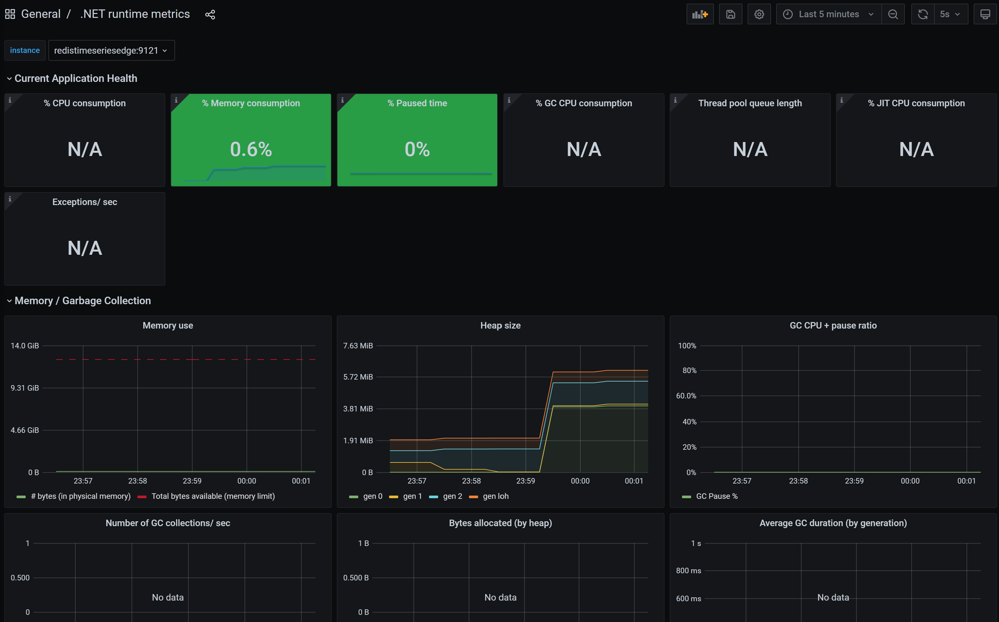

# azure-iot-edge-redis-timeseries
This sample [Azure IoT Edge](https://docs.microsoft.com/en-us/azure/iot-edge/?view=iotedge-2020-11) solution demonstrates how to store timeseries data from IoT sensors in [RedisTimeSeries](https://oss.redislabs.com/redistimeseries/). The [Simulated Temperature Sensor](https://azuremarketplace.microsoft.com/en-us/marketplace/apps/azure-iot.simulated-temperature-sensor?tab=overview) edge module is used to generate temperature, pressure and humidity readings. These readings are then routed to our custom C# edge module which stores them in RedisTimeSeries.

## Features
- Connects to Redis with [Unix Sockets](https://redis.io/topics/clients) instead of the TCP port.
- Sends its .NET Assembly version as an [Azure IoT Hub Module Twin](https://docs.microsoft.com/en-us/azure/iot-hub/iot-hub-devguide-module-twins) Reported Property.
- Makes .NET runtime metrics available in Prometheus format.
- Scrapes Redis usage metrics in Prometheus format.
- Exposes an [Azure IoT Hub Direct Method](https://docs.microsoft.com/en-us/azure/iot-hub/iot-hub-devguide-direct-methods) named `GetTimeSeriesInfo`. This method can be used to retrieve statistics about the stored data in RedisTimeSeries.
- Provides Grafana dashboards for visualizing timeseries and above Prometheus data sources, [see below](#grafana-dashboards).

## Architecture

## Prerequisites
- Azure IoT Hub with an edge device provisioned
- [Docker Community Edition](https://docs.docker.com/get-docker/)
- [.NET Core 3.1](https://dotnet.microsoft.com/download/dotnet/3.1)
- [Python 3.8](https://www.python.org/downloads/release/python-389/)
- [Azure IoT EdgeHub Dev Tool](https://github.com/Azure/iotedgehubdev)
- [Visual Studio Code](https://code.visualstudio.com/) with the following extensions
    - [C#](https://marketplace.visualstudio.com/items?itemName=ms-dotnettools.csharp)
    - [Docker](https://marketplace.visualstudio.com/items?itemName=ms-azuretools.vscode-docker)
    - [Azure IoT Tools](https://marketplace.visualstudio.com/items?itemName=vsciot-vscode.azure-iot-tools)

## Configuration
The `.env` file can be modified for container version, container host names and to use an [Azure Container Registry](https://docs.microsoft.com/en-us/azure/container-registry/) instead of a local docker registry.

## Grafana Dashboards
Simulated timeseries dashboard was created using the [Redis Data Source for Grafana](https://github.com/RedisGrafana/grafana-redis-datasource).

Redis usage dashboard was created using the [Prometheus Redis Metrics Exporter](https://github.com/oliver006/redis_exporter).

.NET runtime metrics dashboard was created using [prometheus-net.DotNetMetrics](https://github.com/djluck/prometheus-net.DotNetRuntime).

